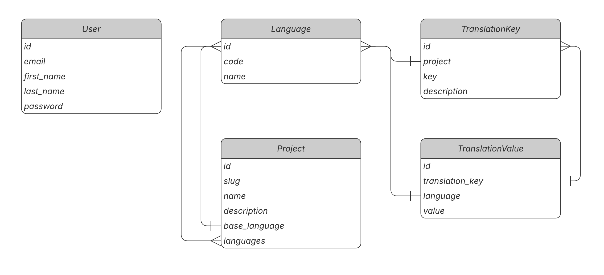

# Version 0.1.0

## Seed Database

Fill the database with development data (projects, keys, translations, admin user):

```bash
python manage.py seed_db
```

The command is **idempotent** — running it again skips already existing objects.

To wipe all seeded data and re-create from scratch:

```bash
python manage.py seed_db --flush
```

### What gets created

| Entity           | Details                                          |
| ---------------- | ------------------------------------------------ |
| Superuser        | `admin@admin.com` / `admin`                      |
| web-app          | 321 keys, languages: en, uk, de, fr, es          |
| mobile-app       | 60 keys, languages: en, uk, pl, ja               |
| marketing-site   | 40 keys, languages: en, uk, de, fr, es, pl       |

- Keys have 3-4 levels of nesting (e.g. `auth.login.form.title`).
- English (base language) is 100 % translated.
- Target languages have ~20 % of keys intentionally left untranslated.
- Translations are pseudo-localized: `[UK] Save`, `[DE] Loading...`, etc.

## DB Schema Diagram

