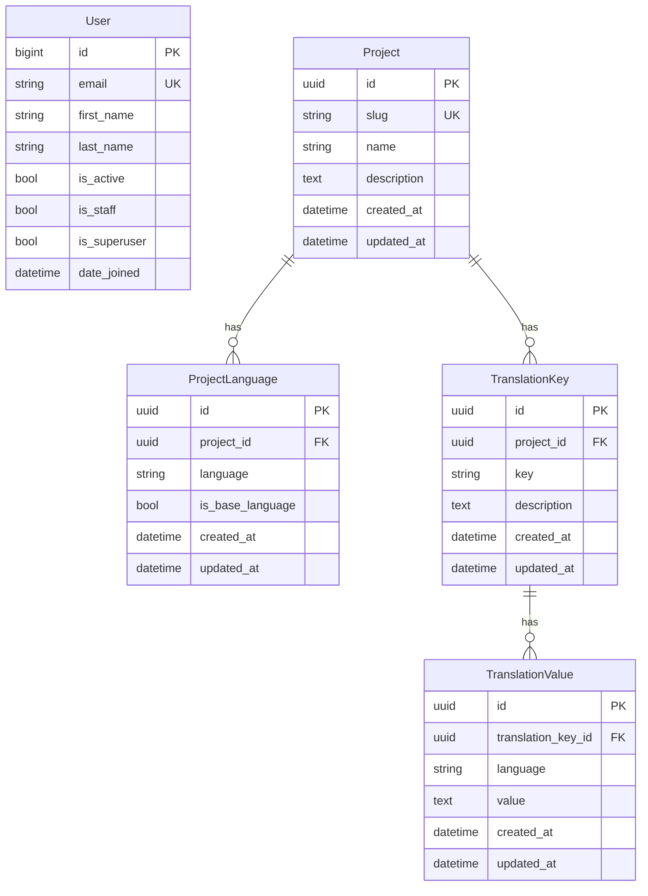

# Database Schema

Entity-relationship diagram of the TMS data model.

> Generated from Django models. Update this file when models change.

**Constraints:**
- `ProjectLanguage`: unique `(project, language)`, only one `is_base_language=true` per project
- `TranslationKey`: unique `(key, project)`, key format: `^[a-z0-9]+(?:[._][a-z0-9]+)*$`
- `TranslationValue`: unique `(translation_key, language)`
